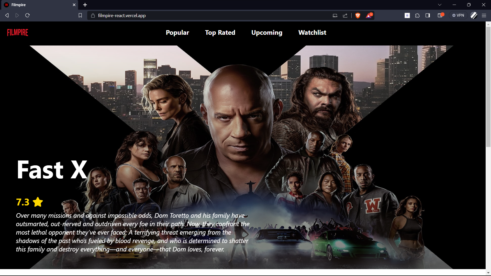
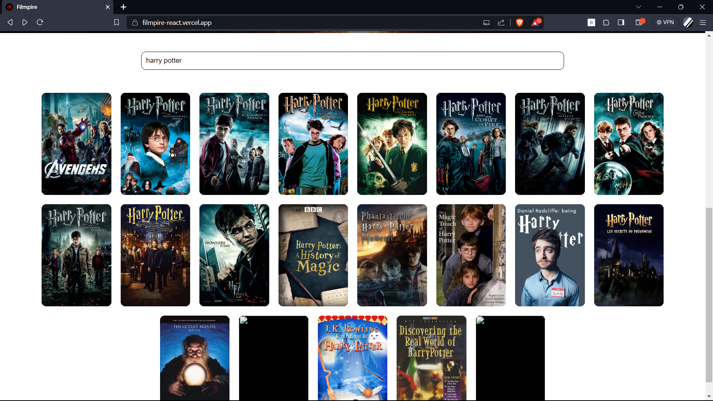
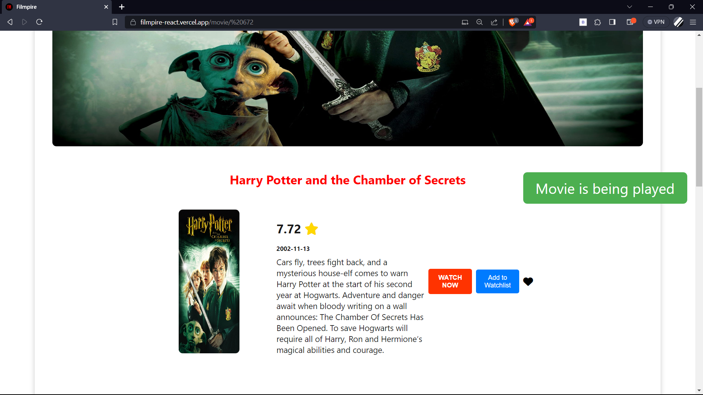
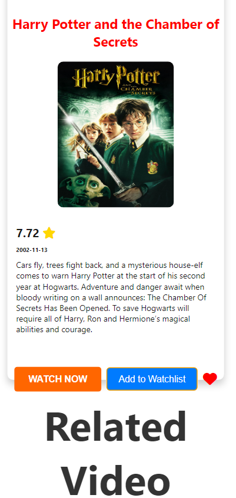
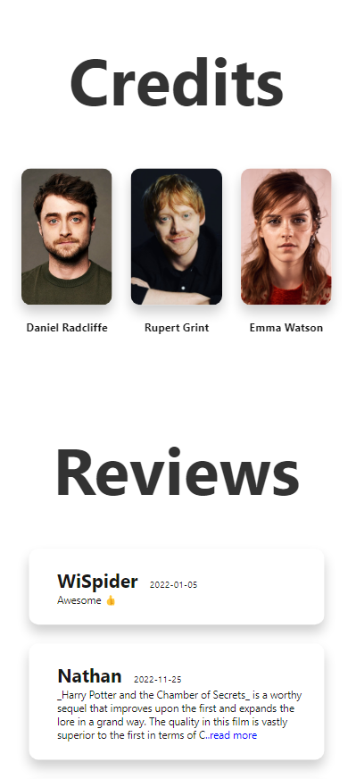
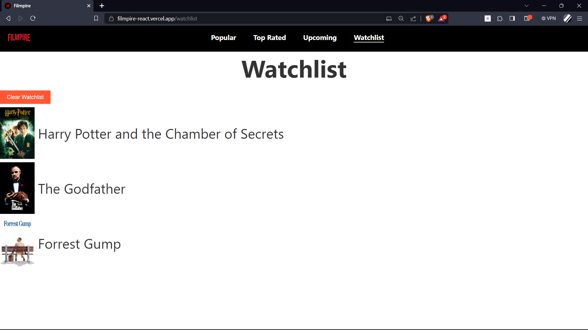

# Movie Web App : Filmpire

Demo Link : https://filmpire-react.vercel.app/

### Home Page



- Navbar with options:
  - Movies (landing screen)
  - Popular, Upcoming, Top Rated
  - Watchlist

### Movies Screen


- Displays movie images, names, and genre/category cards.
- Allows users to search for movies on the same screen.


## Movie Details Page
### Completely Responsive Design

<div>
  
</div>


- Displasy the following details:
  - Movie Banner
  - Name
  - Overview/Description
  - Release Date
  - Genre
  - User ratings/Score (as a Star ⭐)
  - Play Now button (Displays an in-app notification when clicked with the message "Movie is Playing")
  - Users can mark movies as Favourites or add them to their Watchlist.

### Watchlist Screen



- Displays the user's list of movies they want to watch later.
- This uses the local storage functionality.
- "Clear Watchlist" button clears the watchlist and remove item from local storage.


 
## Installation

Follow these steps to set up and run the project locally:

1. **Clone the repository:**
   ```sh
   git clone https://github.com/shubhjaiswal02/Filmpire-react.git
2. **Intall the dependencies**
   ```sh
   npm install
3. **Start the application**
   ```sh
   npm start

### API Documentation

Uses the [TMDB API](https://www.themoviedb.org/) for fetching movie data.


